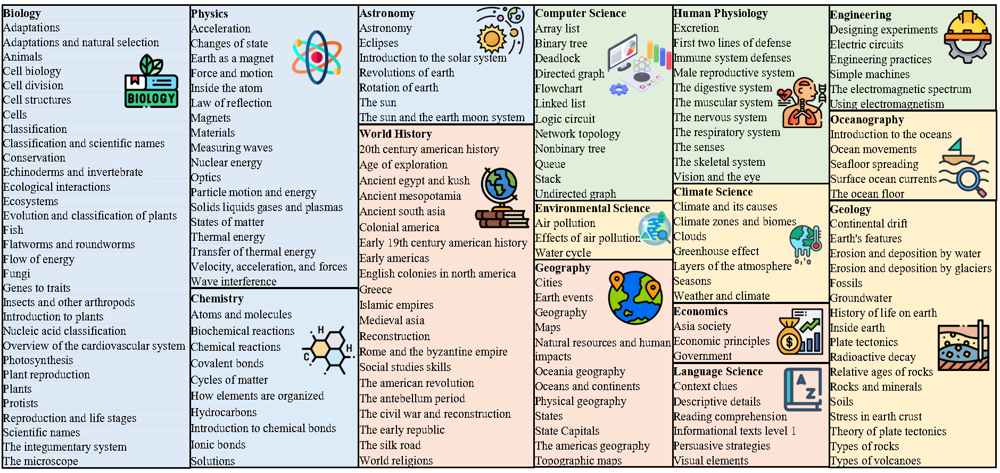

license: apache-2.0
# DiagramQG: A Dataset for Generating Concept-Focused Questions from Diagrams 
# DiagramQG Dataset

*Figure 1: Four different examples of different subjects in DiagramQG dataset.*

*Figure 2: Domain diversity in DiagramQG. Each color corresponds to one subject: Natural Science (blue), Earth Science (yellow), Applied Science (green), and Social Science (orange).*

## Overview
DiagramQG is a comprehensive educational dataset focused on scientific diagram question generation. It contains:

- 19,475 unique questions
- 8,372 diagrams  
- 44,472 combinations of (target & concept text constraint, diagram, question)
- Coverage across 4 subjects, 15 courses, and 169 concepts

# Due to the ongoing peer review process of our research paper, we are currently releasing a subset of the DiagramQG dataset. #

## Dataset Structure

### Subject Areas
The dataset covers four main subject areas:
- Natural Science
- Earth Science  
- Applied Science
- Social Science

### Hierarchical Organization
Data is organized hierarchically:
1. Subject (e.g., Natural Science)
2. Course (e.g., Biology)  
3. Concept (e.g., Ecological interactions)

## Data Collection Process

### Phase 1: Initial Data Gathering
- Sources: Existing datasets and Google Image Search
- Raw dataset: 20,000+ diagrams and 40,000+ questions

### Phase 2: Organization
- Classification into 4 subjects and 15 courses
- Mapping questions to 169 distinct concepts

### Phase 3: Annotation
- Trained crowd workers annotate:
  - Target & concept text constraints
  - Diagram elements and texts
- Produced 70,000+ unique combinations

### Phase 4: Quality Assurance
- Secondary crowd worker evaluation (0-100 scale)
- Filtered combinations below 60 points
- Final dataset: 44,472 validated combinations

## Dataset Analysis

### Question Distribution

*Figure 3: Question distribution in DiagramQG.*

### Concept Distribution

*Figure 4: Distribution of diagrams, questions, and questions per diagram ratios across different concepts in DiagramQG.*

### Dataset Comparison
| Dataset | Questions | Images | Objects/Image | Image Type | Constraints | Knowledge Type |
|---------|-----------|---------|---------------|------------|-------------|----------------|
| VQAv2.0 | 1.1M | 20k | 3.5 | natural | answer | N/A |
| FVQA | 5,826 | 2k | 2.9 | natural | answer | common-sense |
| VQG-COCO | 25,000 | 5k | 3.3 | natural | image, caption | common-sense |
| K-VQG | 16,098 | 13K | 2.7 | natural | knowledge triple | common-sense |
| DiagramQG | 19,475 | 8,372 | 11.2 | diagram | target, concept | subject knowledge |

## Unique Challenges

1. **Domain-specific Knowledge Requirement**
   - Requires understanding of specialized subject concepts
   - Goes beyond common sense reasoning

2. **Long-tail Distribution**
   - Uneven concept coverage
   - Challenges in model generalization

3. **High Information Density**
   - Complex diagram interpretation
   - Dense visual information processing